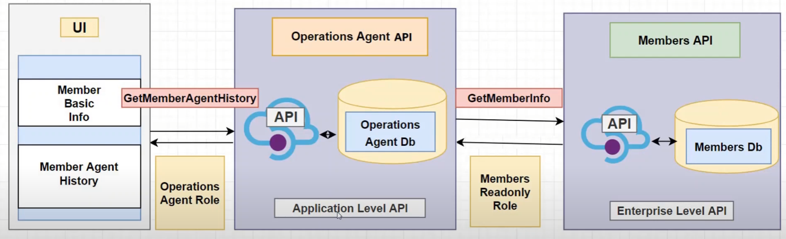

# OpenIDConnect.AZ204.API



## Register the apps in Azure Active Directory

- Create resource group: `az group create --name "rg-open-id-connect" --location "centralus"`

#### Operations App registration

- Create AD app registration: `az ad app create --display-name "OperationsAgentApiApp"`
- Set Application ID URI at `App registrations -> OperationsAgentApiApp`
- Add a scope: `OperationsAgent.All`
- Client ID: `938ae338-fa49-4000-8642-dbad0541f6b7`
- Tenant ID: `b40a105f-0643-4922-8e60-10fc1abf9c4b`

#### Members App registration

- Create AD app registration: `az ad app create --display-name "MembersApiApp"`
- Set Application ID URI at `App registrations -> MembersApiApp`
- Add a scope: `OperationsAgent.All`
- Client ID: `0452f9c6-818b-426d-91cd-e33d7a618f7a`
- Tenant ID: `b40a105f-0643-4922-8e60-10fc1abf9c4b`
- `MembersApi` is consumed by `OperationsAgentApi` so add a client application on behalf of `MembersApi` providing the
  client ID `938ae338-fa49-4000-8642-dbad0541f6b7`
- Create role: `Members.Readonly`

#### Operations App registration

- Create role: `OperationsAgent`

## Configure OpenIDConnect.AZ204.Members ASP NET Core Web API

- Create .NET 6 Web API from template
- Install nuget packages:
    - `dotnet add package Microsoft.AspNetCore.Authentication.JwtBearer`
    - `dotnet add package Microsoft.AspNetCore.Authentication.OpenIdConnect`
    - `dotnet add package Microsoft.Identity.Web`
    - `dotnet add package Microsoft.Identity.Web.UI`
    - `dotnet restore`
- Add Authentication to the project services DI: `builder.Services
  .AddAuthentication(OpenIdConnectDefaults.AuthenticationScheme)
  .AddMicrosoftIdentityWebApp(configurationSection);`
- Update appsettings.json with the following section: 
```bash 
  "AzureAd": {
    "Instance": "https://login.microsoftonline.com/",
    "Domain": "kolosovp94gmail.onmicrosoft.com",
    "TenantId": "b40a105f-0643-4922-8e60-10fc1abf9c4b",
    "ClientId": "ff97d604-c3de-46c8-a96c-1d3491998d7c",
    "CallbackPath": "/signin-oidc"
  }
```